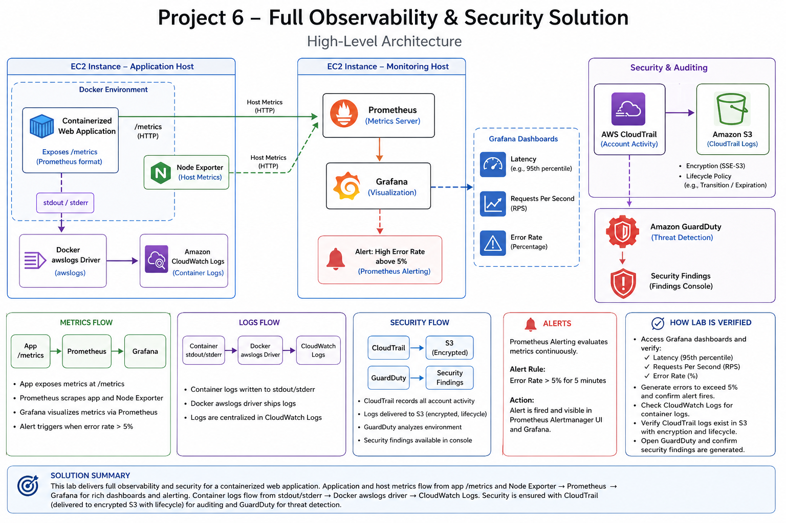
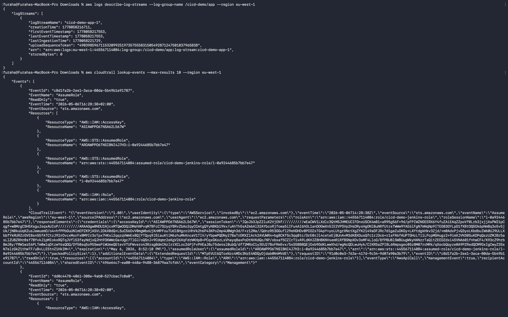
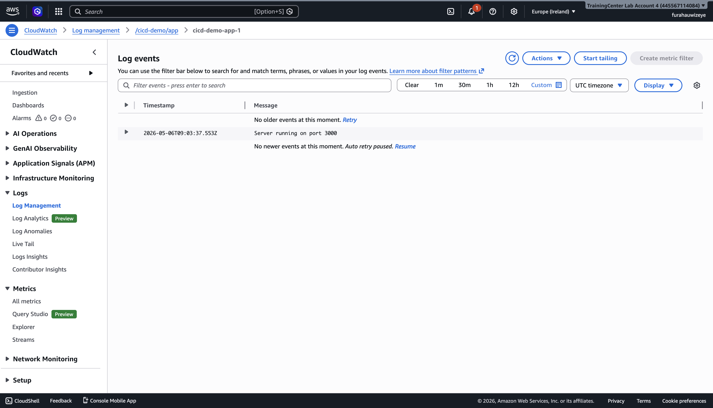
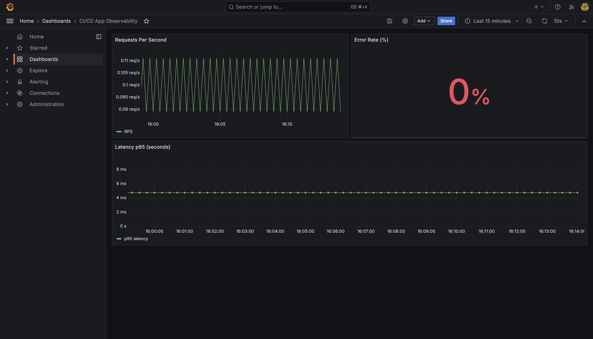
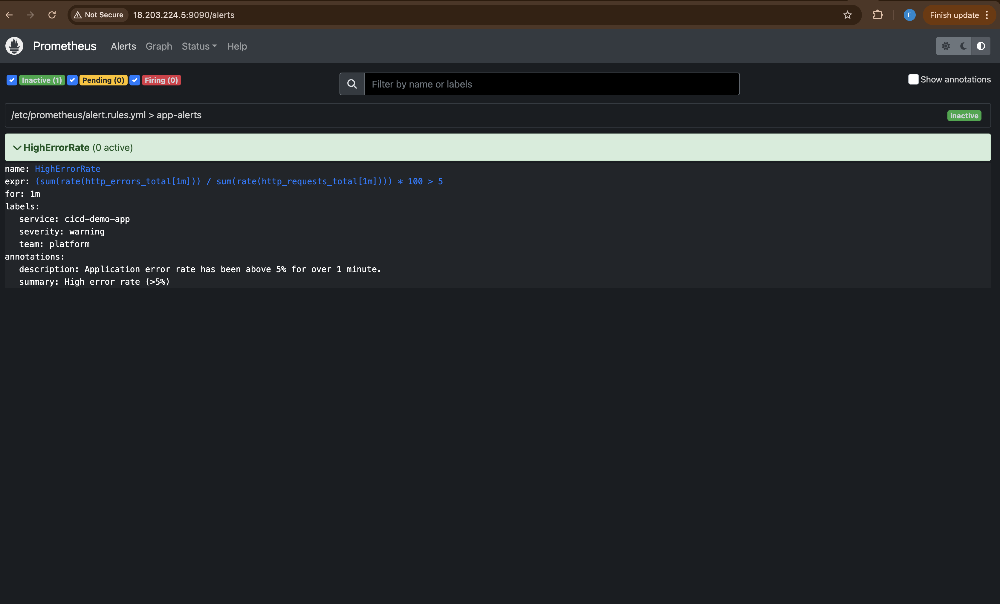
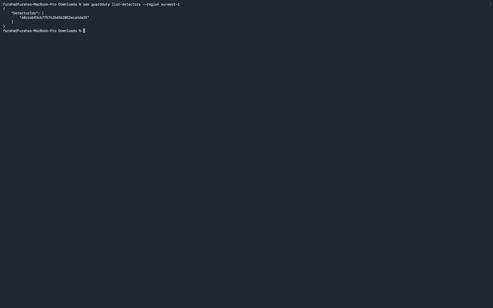

# cicd-pipeline-monitoring — Observability & Security for a Containerized App

This repository demonstrates a production-style observability and security stack for a containerized
Node.js application. It integrates metrics, visualization, logging, and AWS security services so you
can deploy, verify, and demonstrate a full monitoring + security workflow.


Overview
--------

- Purpose: Extend a containerized web app and Jenkins CI/CD with Prometheus, Grafana, CloudWatch,
  CloudTrail, and GuardDuty to provide full observability and basic account-level security.
- Scope: Production-like deployment across three EC2 roles — Jenkins (CI/CD), App (runtime),
  Monitoring (Prometheus + Grafana). Docker is used to run app and monitoring components.

### System Design
   
Quick start (production-focused)
-------------------------------

Prerequisites

```bash
brew install terraform ansible awscli jq
aws configure
```

1) Populate secrets

```bash
cp ansible/secrets.yml.example ansible/secrets.yml
# Edit ansible/secrets.yml: docker_hub_user, docker_hub_token, key_path, (optional) github_token
```

2) Provision infrastructure

```bash
cd terraform
terraform init
terraform apply -auto-approve
cd ..
```

3) Configure hosts and Jenkins

```bash
cd ansible
ansible-playbook -i inventory.ini playbook.yml
ansible-playbook -i inventory.ini configure_jenkins.yml -e @secrets.yml
```

4) Run the Jenkins pipeline (job: `cicd-demo-pipeline`) from the Jenkins UI.

Operational runbook (detailed)
-----------------------------

Provisioning

- Terraform provisions EC2 instances (Jenkins, App, Monitoring), S3 for CloudTrail, and enables
  GuardDuty. Outputs include public IPs used to build the Ansible inventory.

Configuration

- Ansible installs Docker, deploys Node Exporter on the App host, and runs Prometheus + Grafana
  containers on the Monitoring host. It also configures Jenkins (plugins, credentials, pipeline job)
  using `configure_jenkins.yml` and the templated Groovy script (`ansible/templates/create_credentials.groovy.j2`).

CI/CD & Deployment

- The `Jenkinsfile` builds, tests, packages a Docker image, pushes images to Docker Hub, and
  deploys to the App EC2 via SSH. Deployment runs the container with `--log-driver=awslogs` so
  container stdout/stderr stream to CloudWatch Logs.

Verification & evidence
-----------------------

Automated verification (production):

```bash
PROM_URL=http://<MONITOR_IP>:9090 APP_URL=http://<APP_IP>:3000 bash scripts/verify_observability.sh
```

Manual checks (examples):

```bash
# Prometheus targets
curl -s http://<MONITOR_IP>:9090/api/v1/targets | jq '.data.activeTargets[] | {job: .labels.job, health: .health}'

# Prometheus queries
curl -sG "http://<MONITOR_IP>:9090/api/v1/query" --data-urlencode 'query=sum(rate(http_requests_total[1m]))' | jq

# CloudWatch logs
aws logs describe-log-streams --log-group-name /cicd-demo/app --region eu-west-1

# CloudTrail events
aws cloudtrail lookup-events --max-results 10 --region eu-west-1

# GuardDuty detectors
aws guardduty list-detectors --region eu-west-1
```

Evidence checklist (for submission)

- Prometheus targets screenshot (app + node exporter UP)
- Grafana App dashboard screenshot (RPS, error rate, p95 latency)
- Grafana Node Exporter dashboard screenshot
- Prometheus alert firing screenshot (HighErrorRate)
- CloudWatch Logs screenshot showing app logs
- CloudTrail events screenshot
- GuardDuty detector enabled screenshot

Architecture highlights
-----------------------

- Metrics flow: `app:/metrics` → Prometheus (scrape) → Grafana (visualize)
- Host metrics: Node Exporter on App EC2 → scraped by Prometheus
- Logs flow: container stdout → Docker `awslogs` driver → CloudWatch Logs
- Security: CloudTrail writes to encrypted S3 with lifecycle rules; GuardDuty analyzes account data and produces findings

Prometheus alerting example
---------------------------

Alert: `HighErrorRate` (fires when error rate &gt; 5% for 1 minute). See `observability/alert.rules.yml`.

Key PromQL:

```promql
sum(rate(http_requests_total[1m]))

(sum(rate(http_errors_total[1m])) / sum(rate(http_requests_total[1m]))) * 100

histogram_quantile(0.95, sum(rate(http_request_duration_seconds_bucket[5m])) by (le))
```

## 📸 Screenshots

The `screenshots/` folder contains evidence of:

### CloudTrail
 
### CloudWatch
   
### Grafana
   
### Prometheus
   
### GuardDuty
   

Files of interest
-----------------

- `observability/` — Prometheus and Grafana configs and dashboards
- `ansible/` — `configure_jenkins.yml`, templates (credentials, pipeline job), monitoring role
- `terraform/` — infra provisioning and security resources
- `Jenkinsfile` — CI/CD pipeline
- `scripts/verify_observability.sh` — production verification helper

Troubleshooting quick tips
-------------------------

- Jenkins credentials missing: re-run `configure_jenkins.yml` with a correct `ansible/secrets.yml`.
- Prometheus target DOWN: ensure Prometheus uses private IPs and security groups permit ports 3000/9100 from monitoring host.
- No CloudWatch logs: confirm container was started with `--log-driver=awslogs` and correct log-group.

## 👨‍💻 Author

Furaha Justine